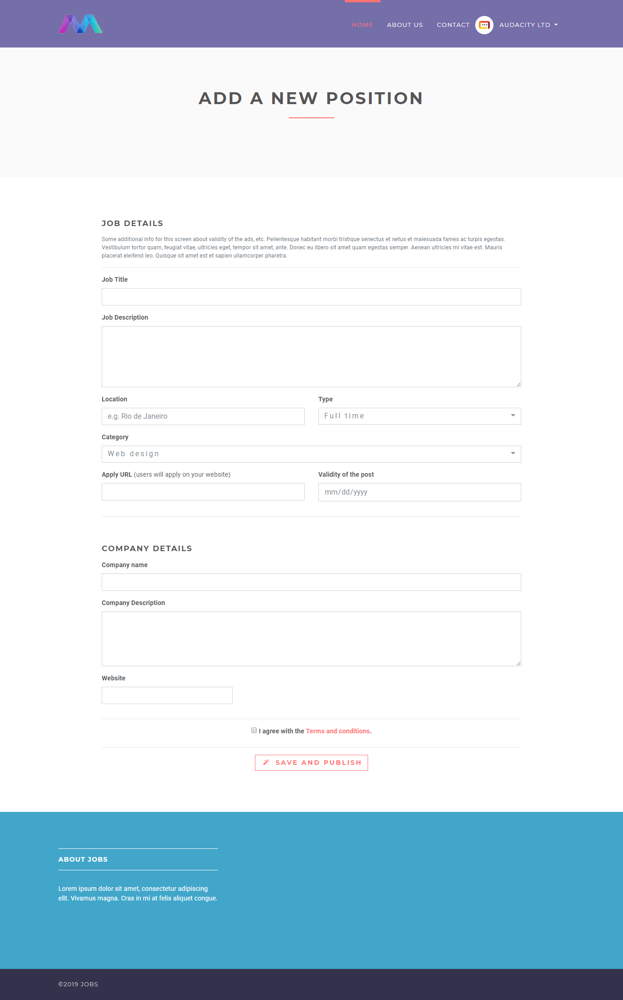

## Job Portal

#### An open source online job portal.

Used Tech Stack

1. Python
2. Django
3. Sqlite
4. HTML
5. Jinja2

### Steps to Setup Env and Run this Application
1. Install python in windows 
	Windows don't include Python by default, but you can easily install it (along with the pip3 tool) from python.org:
    Download the required installer:
        Go to https://www.python.org/downloads/ or https://www.python.org/downloads/windows/
        Select the Download Python 3.7.1 button (the exact minor version number may differ).
    Install Python by double-clicking on the downloaded file and following the installation prompts
    Be sure to check the box labeled "Add Python to PATH" or else go to advanced settings and set path in user variable
	C:\Users\Vishant\AppData\Local\Programs\Python\Python37-32\Scripts\;C:\Users\Vishant\AppData\Local\Programs\Python\Python37-32\;C:\Program Files\Intel\WiFi\bin\;C:\Program Files\Common Files\Intel\WirelessCommon\
	check version:
	py -3 -V 
	python --version
	
2. Install virtualenv
-> pip install virtualenv
check with command pip freeze or pip list to see all the install software
virtualenv==16.0.0

3. Create a virtual environment for your project
-> virtualenv job_venv --no-site-packages

4. Activate virtual environment
-> .\job_venv\Scripts\activate

5. pip install -r requirements.txt

6. python manage.py runserver 0.0.0.0:8000

7. Go to browser and open http://127.0.0.0:8000/

### Screenshots

## Home page

## Add new position as employer

## Job details

Show your support by 🌟 the project!!